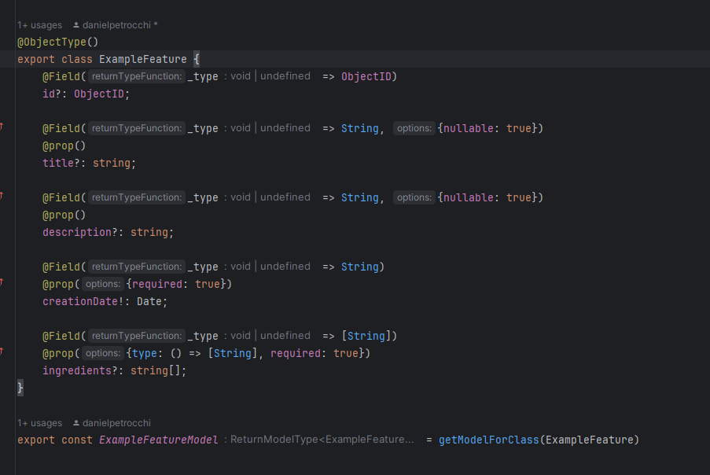

## Getting started
### 1) Setup the Database
Refer to this guide for setting up the database https://docs.google.com/document/d/1i49D7aFk3rHXSk8lZtyHB7Nc9aF12x48L_vsXDYKYbk/edit#heading=h.2dggxxkf8pjr
### 2) Update package.json
Edit all the fields that reference the template into the correct ones for your new service


### Important: 
#### Graphql / Typegoose helper functions
Source [helpers.ts](src/schema/helpers.ts)

To be able to use TypeGraphql and Typegoose together without the need to specify each decorator separately we invented the following combined Decorators:

#### 1) RequiredGraphqlProp
#### 2) RequiredGraphqlPropRef
#### 3) GraphqlProp
#### 4) GraphqlPropRef
#### 5) RequiredGraphqlArrayProp
#### 6) RequiredGraphqlArrayPropRef
#### 7) GraphqlArrayProp
#### 7) GraphqlArrayPropRef
#### 7) RequiredGraphqlArrayField
#### 7) GraphqlArrayField
#### 7) RequiredGraphqlField
#### 7) GraphqlField
#### 7) GraphqlId
#### 7) NullableGraphqlId
#### 7) GraphqlDateTime




## Referencing external resources
https://www.apollographql.com/docs/federation/entities/#referencing-an-entity-without-contributing-fields
```

// This will allow you to reference the EmailSender class inside your 
types without actually defining it's fields.  

@Directive("@extends")
@Directive('@key(fields: "_id", resolvable: false)')
@ObjectType()
export class EmailSender {

    @Directive("@external")
    @GraphqlId()
    _id!: ObjectId
}

// The referenced entity needs to be:
@Directive('@key(fields: "_id")')
@ObjectType()
export class EmailSender {
    @GraphqlId()
    _id!: Readonly<ObjectId>

    @prop()
    userId!: ObjectId;
.. other fields
}

export async function resolveEmailSenderReference(reference: Pick<EmailSender, "_id">): Promise<EmailSender | null> {
    return EmailSenderModel.findOne({_id: reference._id})
}

// in index.ts
 const schema = await buildTypeGraphqlSubgraphSchema({..options}, {
      EmailSender: {
          __resolveReference: resolveEmailSenderReference
      }
  })

```


## References

1) Typescript Framework for GraphQL API in Node.js https://typegraphql.com/docs/getting-started.html
2) Mongodb manual https://www.mongodb.com/docs/manual/crud/
3) Typegoose https://typegoose.github.io/typegoose/docs/guides/quick-start-guide
